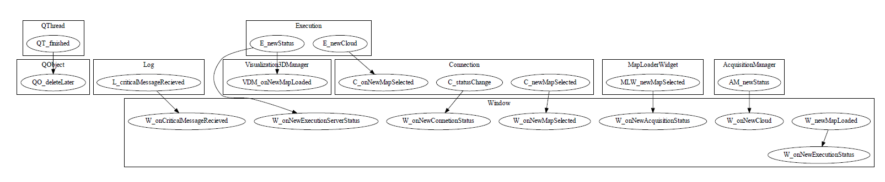

# QT Connection Finder

QT 5.9.1

Python script to explore `c++` code, locate QT connections and plot them.

It looks for `connect` keyword, using 2nd and 4th arguments finds classes and methods connected.

# Depends on:

 - [Graphviz](https://graphviz.readthedocs.io/en/stable/index.html), here a link for [Anaconda](https://anaconda.org/conda-forge/python-graphviz) users.

# Demo

